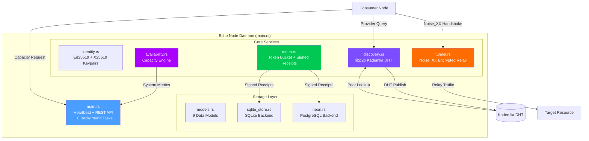
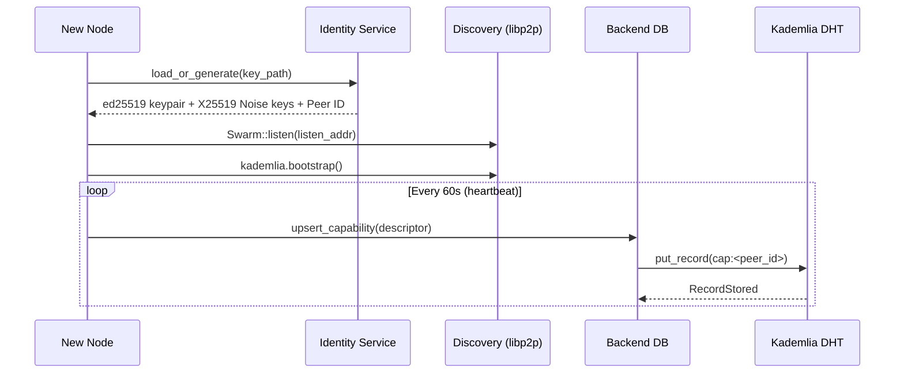
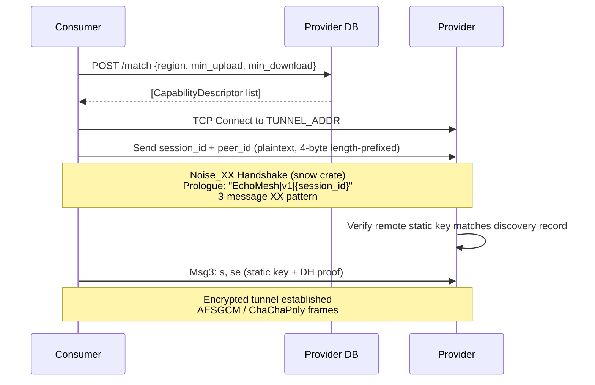
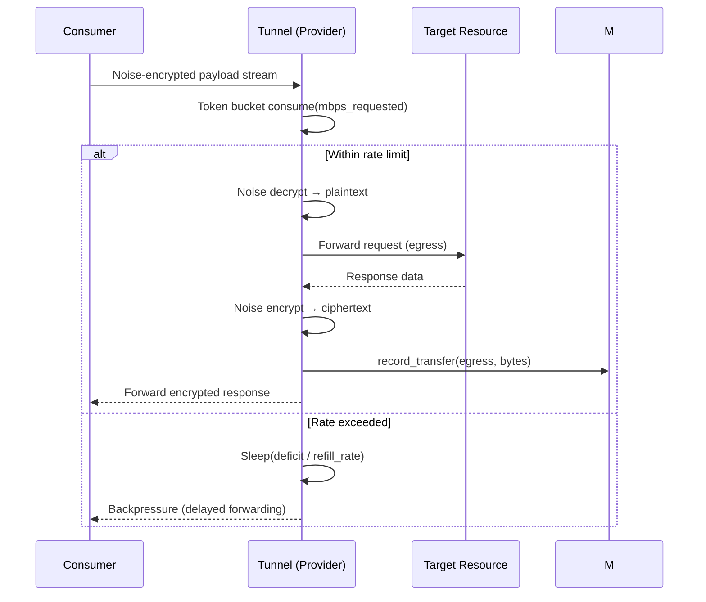
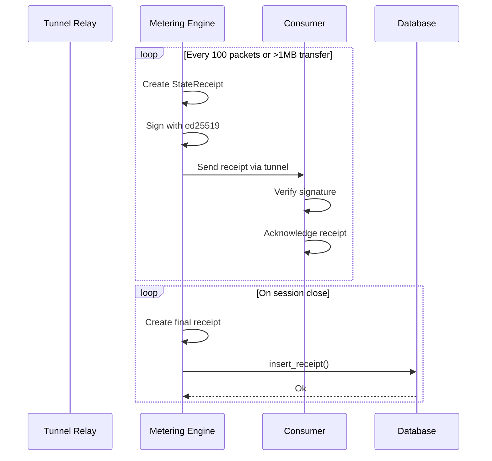
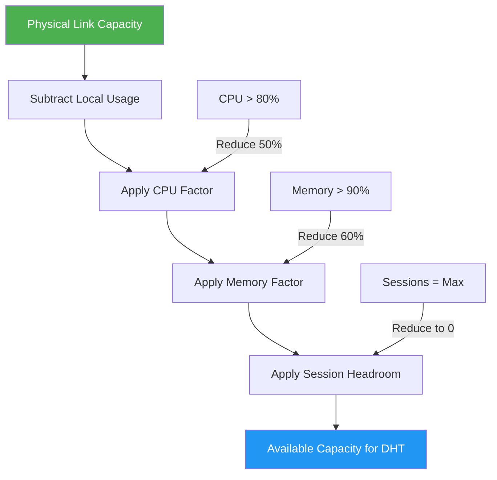
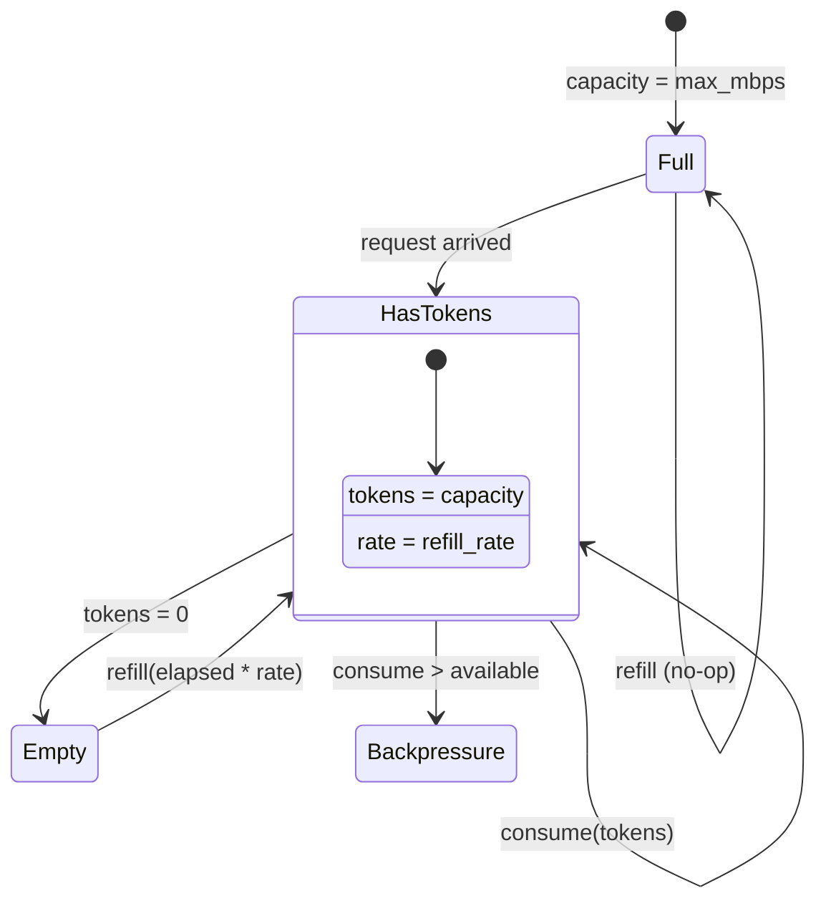

# Echo Node

Rust daemon for the EchoMesh decentralized infrastructure network. A provider node that shares unused network capacity with consumers through Noise_XX-encrypted tunnels, discovered via a Kademlia DHT.

## Architecture Overview



## Step-by-Step Flow

### 1. Registration & Peer Discovery



### 2. Matchmaking & Noise_XX Handshake



### 3. Data Tunneling & Rate Limiting



### 4. Metering & Receipt Settlement



## Security Model

| Layer | Mechanism | Detail |
|-------|-----------|--------|
| **Tunnel encryption** | Noise_XX_25519_ChaChaPoly_BLAKE2s | 3-message XX pattern via `snow` crate |
| **Session binding** | Domain-separated prologue | `"EchoMesh\|v1\|{session_id}"` prevents cross-session replay |
| **MITM prevention** | Static key pinning | Provider's Noise public key verified against DB capability record |
| **Connection limiting** | Semaphore with RAII permits | `OwnedSemaphorePermit` in `EncryptedTunnelSession` |
| **Identity protection** | File permissions 0600 | Unix `set_permissions` on identity file after every write |
| **API authentication** | Constant-time Bearer token | XOR-based comparison prevents timing side-channels |
| **Input validation** | Length caps on pre-handshake messages | session_id <= 256 bytes, peer_id <= 512 bytes |
| **Receipt integrity** | Ed25519 signatures | Provider signs receipts; consumers verify |

## Capacity Engine

The Availability Engine dynamically adjusts advertised bandwidth based on system load:



## Token Bucket Rate Limiter



## Database Schema

```mermaid
erDiagram
    NODES {
        varchar id PK
        varchar name NOT_NULL
        varchar user_id NOT_NULL
        varchar peer_id UK
        text public_key
        text ip_address
        text region
        varchar status NOT_NULL DEFAULT_offline
        text last_seen_at
        double precision uptime NOT_NULL DEFAULT_0
        double precision latency NOT_NULL DEFAULT_0
        double precision bandwidth_used NOT_NULL DEFAULT_0
        double precision quality_score NOT_NULL DEFAULT_0
        double precision earnings NOT_NULL DEFAULT_0
        double precision packet_loss NOT_NULL DEFAULT_0
        double precision uptime_pct
        double precision avg_latency_ms
        double precision bandwidth_down_mbps
        double precision bandwidth_up_mbps
        double precision packet_loss_pct
        double precision trust_score
        bigint sessions_count
        double precision earnings_usd
        double precision reported_upload_cap_mbps
        double precision reported_download_cap_mbps
        varchar supported_encryption
        jsonb services NOT_NULL DEFAULT_'{}'
        jsonb metadata
        timestamptz last_updated
        text last_ip
        text created_at
        text updated_at
    }

    PEER_REPUTATION {
        text peer_id PK
        double precision reputation_score
        bigint total_bytes_relayed
        bigint successful_sessions
        bigint failed_sessions
        double precision avg_latency_ms
        text last_active_at
        text recorded_at
    }

    CONNECTION_HISTORY {
        bigint id PK
        text local_peer_id FK NOT_NULL
        text remote_peer_id FK NOT_NULL
        text remote_ip
        integer remote_port
        text direction NOT_NULL
        bigint bytes_sent
        bigint bytes_received
        double precision duration_secs
        double precision avg_latency_ms
        text exit_reason
        text started_at
        text ended_at
    }

    STATE_RECEIPTS {
        text receipt_id PK
        text session_id FK NOT_NULL
        text signer_peer_id FK NOT_NULL
        text counterparty_peer_id FK NOT_NULL
        bigint bytes_transferred
        text direction NOT_NULL
        bigint sequence_number
        bigint timestamp_secs
        text signature NOT_NULL
    }

    CAPABILITY_DESCRIPTORS {
        text peer_id PK
        bytea public_key NOT_NULL
        text region NOT_NULL
        double precision upload_cap_mbps
        double precision download_cap_mbps
        double precision avg_latency_ms
        double precision reputation_score
        text supported_encryption
        integer max_sessions
        integer active_sessions
        bigint last_updated
        bytea noise_public_key
    }

    NODES ||--o| PEER_REPUTATION : "peer_id"
    NODES ||--o{ CONNECTION_HISTORY : "local_peer_id"
    NODES ||--o{ STATE_RECEIPTS : "signer_peer_id"
    NODES ||--o| CAPABILITY_DESCRIPTORS : "peer_id"
```

## Module Structure

```
src/
├── lib.rs              # MetricsBackend trait (13 methods) + re-exports
├── main.rs             # Heartbeat, REST API, 8 background tasks (1159 lines)
├── models.rs           # 9 data models (NodeRow, PeerReputation, etc.)
├── identity.rs         # Ed25519 + X25519 keypairs, Peer ID, file permissions
├── discovery.rs        # libp2p Kademlia DHT swarm, provider discovery
├── tunnel.rs           # Noise_XX handshake, bidirectional relay, backpressure (795 lines)
├── meter.rs            # Token bucket, signed receipts, session metering
├── availability.rs     # Capacity engine, session management
├── neon.rs             # PostgreSQL backend (inline DDL + migrations)
└── sqlite_store.rs     # SQLite backend (inline DDL + migrations)
```

## Quick Start

```bash
# Local development (SQLite, no external deps)
cargo run

# Production (Neon PostgreSQL)
cp .env.example .env
# Fill in DATABASE_URL, USER_ID, NODE_NAME, NODE_REGION
cargo run --release
```

## API Endpoints

| Method | Path | Auth | Description |
|--------|------|------|-------------|
| GET | `/metrics` | None | Latest metrics with capacity info |
| GET | `/nodes` | None | Node info with peer ID + availability |
| GET | `/history` | None | Last 60 metric samples |
| GET | `/status` | None | Daemon status + active sessions |
| GET | `/health` | None | Health check (healthy/degraded/unhealthy) |
| POST | `/match` | None | Query providers by region + min bandwidth |
| POST | `/control` | Bearer | Start/stop/restart daemon |

### Response Examples

**GET /status**
```json
{
  "running": true,
  "node_id": "node-1694000000",
  "peer_id": "12D3KooWQooCi...",
  "uptime_secs": 3600,
  "heartbeat_count": 360,
  "last_heartbeat": 1694003600,
  "db_connected": true,
  "active_sessions": 3
}
```

**POST /match**
```json
{
  "region": "us-west",
  "min_upload_mbps": 10.0,
  "min_download_mbps": 50.0
}
```

## Environment Variables

| Variable | Default | Description |
|----------|---------|-------------|
| `DATABASE_URL` | (unset) | Neon PostgreSQL URL (uses SQLite if unset) |
| `USER_ID` | `default` | User identifier |
| `NODE_ID` | `node-{epoch}` | Node identifier |
| `NODE_NAME` | `EchoNode` | Display name |
| `NODE_REGION` | `auto` | Region tag for DHT publishing |
| `LISTEN_ADDR` | `0.0.0.0:3001` | REST API bind address |
| `SQLITE_DB` | `sqlite:echo_node.db` | SQLite database path |
| `PING_TARGETS` | `1.1.1.1,8.8.8.8,208.67.222.222` | Comma-separated ping targets |
| `MAX_UPLOAD_MBPS` | `100.0` | Physical uplink capacity (Mbps) |
| `MAX_DOWNLOAD_MBPS` | `100.0` | Physical downlink capacity (Mbps) |
| `MAX_SESSIONS` | `10` | Max concurrent tunnel sessions |
| `IDENTITY_PATH` | `data/identity.json` | Persistent node identity file |
| `API_KEY` | (unset) | API key for `/control` endpoint (Bearer auth) |
| `RELAY_TARGET` | `127.0.0.1:80` | Target address for incoming tunnel relay |
| `TUNNEL_ADDR` | `0.0.0.0:3002` | Tunnel listener bind address |
| `RUST_LOG` | `echo_daemon=info` | Log level filter |

## Dependencies

| Crate | Version | Purpose |
|-------|---------|---------|
| `libp2p` | 0.54 | P2P networking, Kademlia DHT, Identify protocol |
| `snow` | 0.9 | Noise_XX_25519_ChaChaPoly_BLAKE2s handshake |
| `ed25519-dalek` | 2.1 | Cryptographic identity, receipt signing |
| `tokio` | 1.36 | Async runtime (multi-thread) |
| `axum` | 0.7 | REST API framework |
| `tower-http` | 0.5 | CORS middleware |
| `sqlx` | 0.7 | Database (SQLite + PostgreSQL) |
| `sysinfo` | 0.30 | CPU, memory, disk, network metrics |
| `tracing` | 0.1 | Structured logging |
| `chrono` | 0.4 | Date/time handling |
| `serde` | 1.0 | Serialization / deserialization |
| `anyhow` | 1.0 | Error handling |
| `futures` | 0.3 | Stream combinators |

## Background Tasks

The daemon spawns 8 concurrent background tasks on startup:

| # | Task | Line | Description |
|---|------|------|-------------|
| 1 | **Tunnel Event Handler** | 909 | Processes `TunnelEvent::SessionEstablished/Closed` from the tunnel service |
| 2 | **Tunnel Listener** | 951 | Accepts incoming TCP connections on `TUNNEL_ADDR`, initiates Noise_XX handshake |
| 3 | **Discovery Event Loop** | 981 | Runs libp2p swarm event loop, handles DHT GetProviders/PutRecord results |
| 4 | **Discovery Event Handler** | 986 | Processes `DiscoveryEvent::PeerFound/Disconnected/CapabilityPublished` |
| 5 | **Heartbeat** | 1015 | Collects system metrics, measures latency/loss, upserts node record (every 10s) |
| 6 | **Metric Cleanup** | 1021 | Removes metrics older than 30 days (daily) |
| 7 | **Capability Publisher** | 1040 | Publishes `CapabilityDescriptor` to DB for DHT discovery (every 60s) |
| 8 | **Receipt Settlement** | 1068 | Persists signed receipts from metering channel to DB (event-driven, shutdown-aware) |

Additionally, the REST API (axum) and graceful shutdown are combined in a single `axum::serve(...).with_graceful_shutdown(shutdown_signal())` call (line 1148).

## Architecture Decisions

| Decision | Rationale |
|----------|-----------|
| **Noise_XX over TLS** | No certificate infrastructure needed; mutual auth via static keys |
| **snow over libp2p noise** | Explicit control over handshake, prologue binding, key pinning |
| **Semaphore for connections** | RAII permits prevent slot leaks on panic/early drop |
| **Dual DB backends** | SQLite for local dev, PostgreSQL for production |
| **Inline DDL** | No migration tool dependency; schema evolves with code |
| **Constant-time API key** | Prevents timing attacks on the Bearer token |
| **Token bucket backpressure** | Sleep-based backpressure is simpler than channel-based flow control |
| **PeerId-based reputation** | Stable identity across sessions (vs. SocketAddr which changes) |
| **Accumulative reputation** | `total_bytes += delta` preserves historical contribution |
| **Domain-separated prologue** | `"EchoMesh\|v1\|{session_id}"` prevents cross-session replay attacks |
