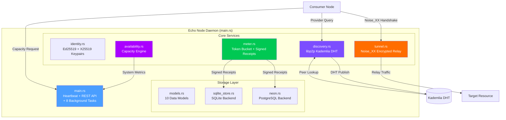
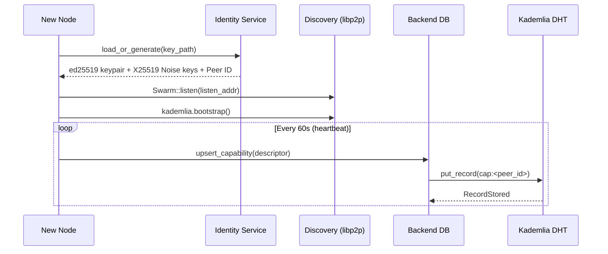
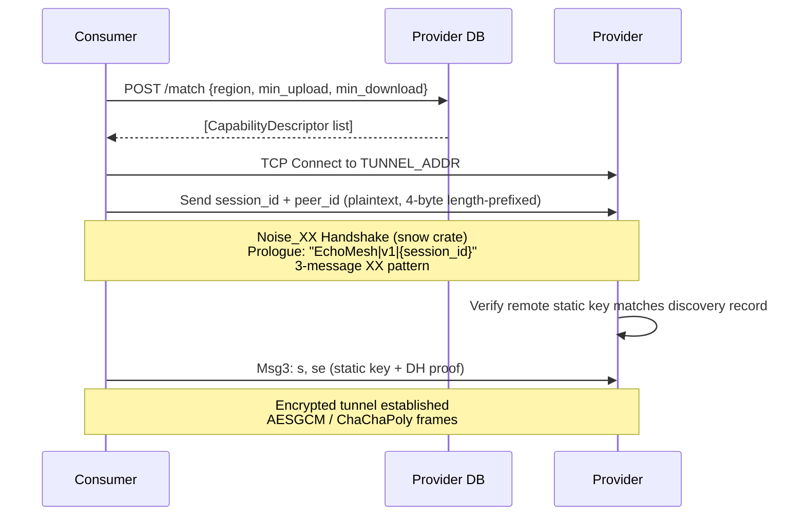
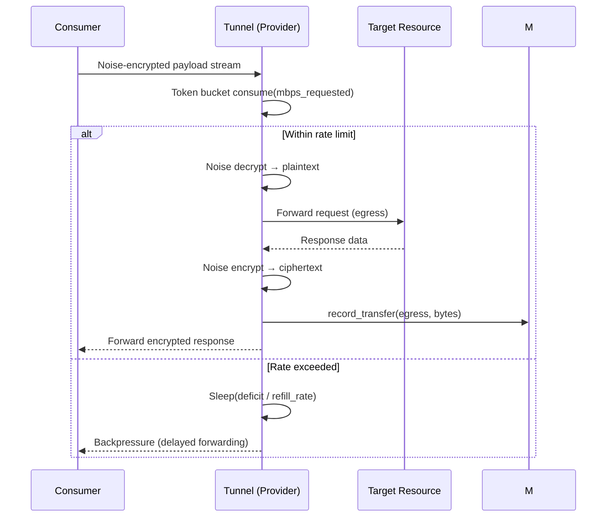
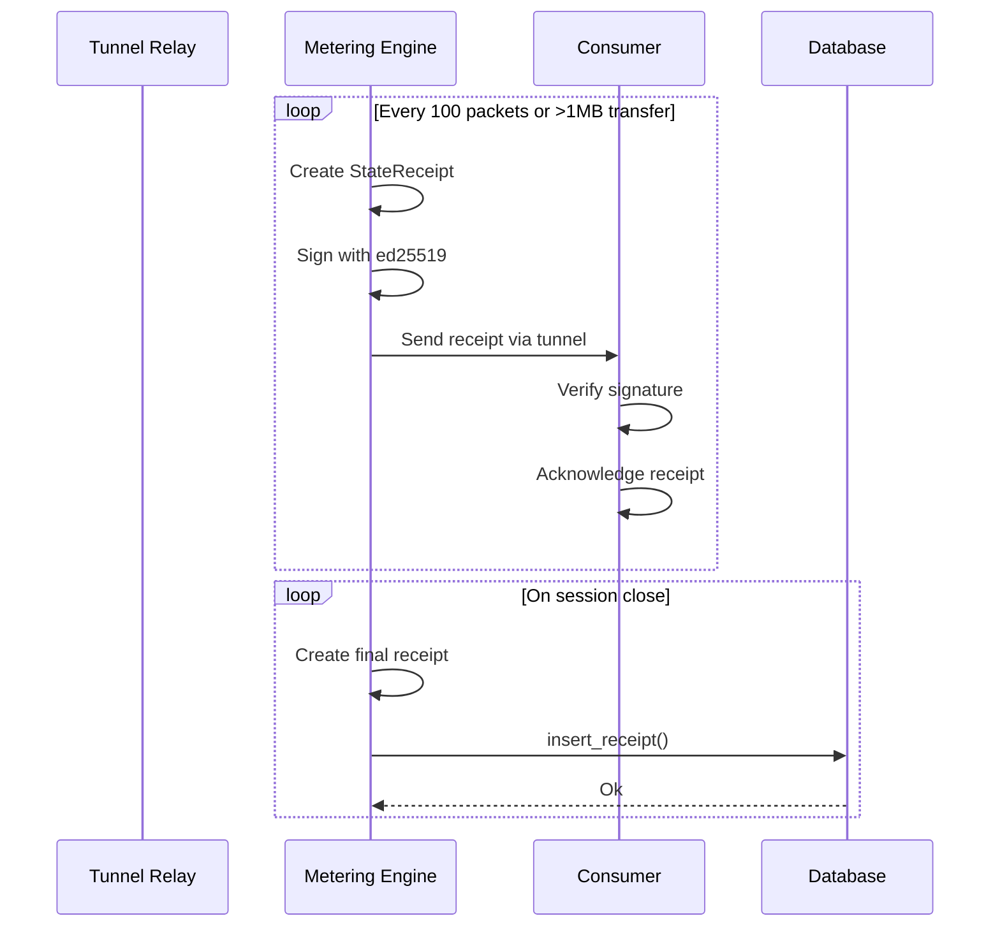
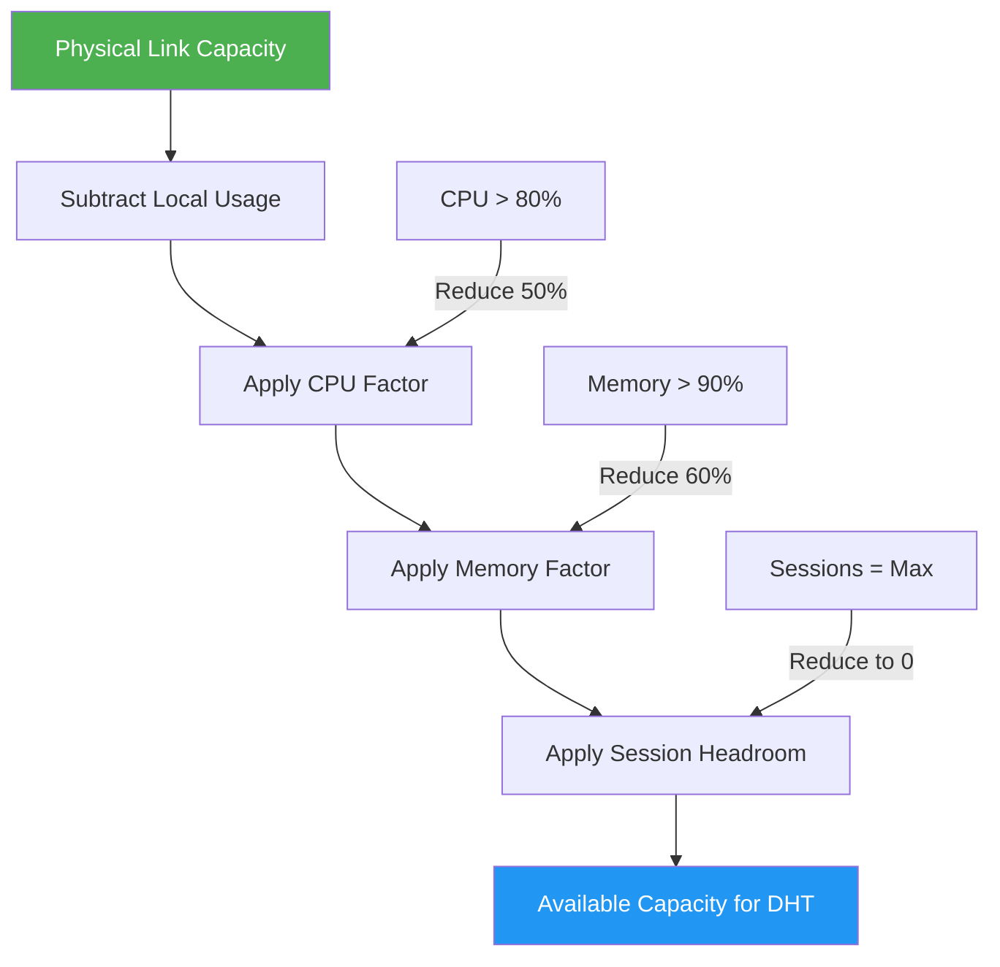
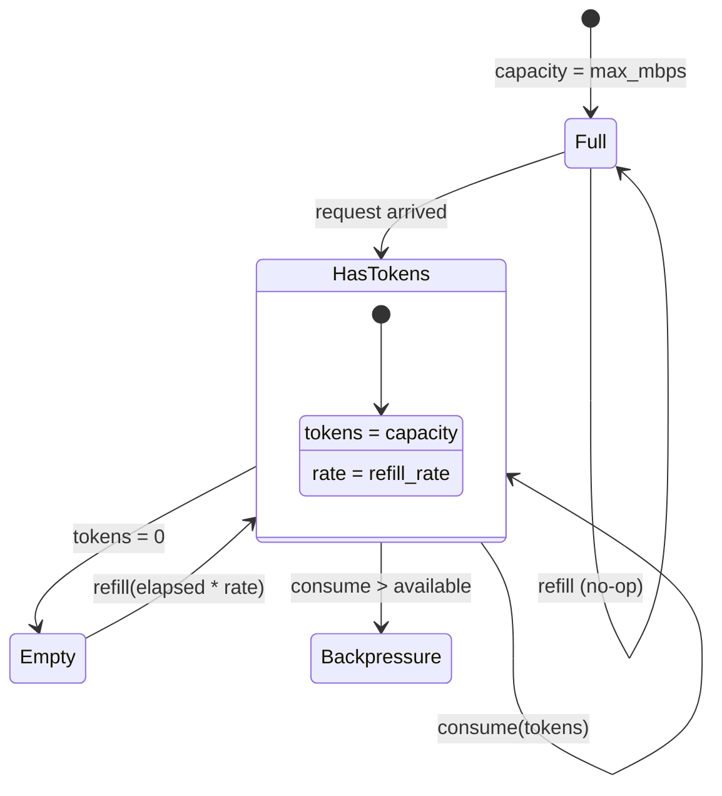

# Echo Node

Rust daemon for the EchoMesh decentralized infrastructure network. A node that either shares unused network capacity as a **provider** (Noise_XX-encrypted tunnels, discovered via a Kademlia DHT) or runs as a **consumer** that dials a provider and forwards local application traffic through the tunnel.

## Architecture Overview


```mermaid
graph TB
    subgraph "Echo Node Daemon (main.rs)"
        MAIN[main.rs<br/>Heartbeat + REST API<br/>+ 8 Background Tasks]

        subgraph "Core Services"
            ID[identity.rs<br/>Ed25519 + X25519 Keypairs]
            AVAIL[availability.rs<br/>Capacity Engine]
            METER[meter.rs<br/>Token Bucket + Signed Receipts]
            DISC[discovery.rs<br/>libp2p Kademlia DHT]
            TUN[tunnel.rs<br/>Noise_XX Encrypted Relay]
        end

        subgraph "Storage Layer"
            MODELS[models.rs<br/>10 Data Models]
            NEON[neon.rs<br/>PostgreSQL Backend]
            SQLITE[sqlite_store.rs<br/>SQLite Backend]
        end
    end

    CONSUMER[Consumer Node] -->|Noise_XX Handshake| TUN
    CONSUMER -->|Provider Query| DISC
    CONSUMER -->|Capacity Request| MAIN

    DISC -->|DHT Publish| DHT[(Kademlia DHT)]
    DHT -->|Peer Lookup| DISC

    TUN -->|Relay Traffic| TARGET[Target Resource]

    METER -->|Signed Receipts| NEON
    METER -->|Signed Receipts| SQLITE
    AVAIL -->|System Metrics| MAIN

    style MAIN fill:#4a9eff,color:#fff
    style DISC fill:#7c4dff,color:#fff
    style TUN fill:#ff6d00,color:#fff
    style METER fill:#00c853,color:#fff
    style AVAIL fill:#aa00ff,color:#fff
```

## Step-by-Step Flow

### 1. Registration & Peer Discovery


```mermaid
sequenceDiagram
    participant N as New Node
    participant I as Identity Service
    participant D as Discovery (libp2p)
    participant B as Backend DB
    participant DHT as Kademlia DHT

    N->>I: load_or_generate(key_path)
    I-->>N: ed25519 keypair + X25519 Noise keys + Peer ID

    N->>D: Swarm::listen(listen_addr)
    N->>D: kademlia.bootstrap()

    loop Every 60s (heartbeat)
        N->>B: upsert_capability(descriptor)
        B->>DHT: put_record(cap:<peer_id>)
        DHT-->>B: RecordStored
    end
```

### 2. Matchmaking & Noise_XX Handshake


```mermaid
sequenceDiagram
    participant C as Consumer
    participant DB as Provider DB
    participant P as Provider

    C->>DB: POST /match {region, min_upload, min_download}
    DB-->>C: [CapabilityDescriptor list]

    C->>P: TCP Connect to TUNNEL_ADDR
    C->>P: Send session_id + peer_id (plaintext, 4-byte length-prefixed)

    Note over C,P: Noise_XX Handshake (snow crate)<br/>Prologue: "EchoMesh|v1|{session_id}"<br/>3-message XX pattern

    P->>P: Verify remote static key matches discovery record
    C->>P: Msg3: s, se (static key + DH proof)

    Note over C,P: Encrypted tunnel established<br/>AESGCM / ChaChaPoly frames
```

### 3. Data Tunneling & Rate Limiting


```mermaid
sequenceDiagram
    participant C as Consumer
    participant T as Tunnel (Provider)
    participant R as Target Resource

    C->>T: Noise-encrypted payload stream
    T->>T: Token bucket consume(mbps_requested)

    alt Within rate limit
        T->>T: Noise decrypt → plaintext
        T->>R: Forward request (egress)
        R-->>T: Response data
        T->>T: Noise encrypt → ciphertext
        T->>M: record_transfer(egress, bytes)
        T-->>C: Forward encrypted response
    else Rate exceeded
        T->>T: Sleep(deficit / refill_rate)
        T-->>C: Backpressure (delayed forwarding)
    end
```

### 4. Metering & Receipt Settlement


```mermaid
sequenceDiagram
    participant T as Tunnel Relay
    participant M as Metering Engine
    participant C as Consumer
    participant DB as Database

    loop Every 100 packets or >1MB transfer
        M->>M: Create StateReceipt
        M->>M: Sign with ed25519
        M->>C: Send receipt via tunnel
        C->>C: Verify signature
        C->>C: Acknowledge receipt
    end

    loop On session close
        M->>M: Create final receipt
        M->>DB: insert_receipt()
        DB-->>M: Ok
    end
```

## Security Model

| Layer | Mechanism | Detail |
|-------|-----------|--------|
| **Tunnel encryption** | Noise_XX_25519_ChaChaPoly_BLAKE2s | 3-message XX pattern via `snow` crate |
| **Session binding** | Domain-separated prologue | `"EchoMesh\|v1\|{session_id}"` prevents cross-session replay |
| **MITM prevention** | Static key pinning | Provider's Noise public key verified against DB capability record |
| **Connection limiting** | Semaphore with RAII permits | `OwnedSemaphorePermit` in `EncryptedTunnelSession` |
| **Identity protection** | File permissions 0600 | Unix `set_permissions` on identity file after every write |
| **API authentication** | Constant-time Bearer token | XOR-based comparison prevents timing side-channels |
| **Input validation** | Length caps on pre-handshake messages | session_id <= 256 bytes, peer_id <= 512 bytes |
| **Receipt integrity** | Ed25519 signatures | Provider signs receipts; consumers verify |

## Capacity Engine

The Availability Engine dynamically adjusts advertised bandwidth based on system load:


```mermaid
flowchart TD
    A[Physical Link Capacity] --> B[Subtract Local Usage]
    B --> C[Apply CPU Factor]
    C --> D[Apply Memory Factor]
    D --> E[Apply Session Headroom]
    E --> F[Available Capacity for DHT]

    G[CPU > 80%] -->|Reduce 50%| C
    H[Memory > 90%] -->|Reduce 60%| D
    I[Sessions = Max] -->|Reduce to 0| E

    style A fill:#4caf50,color:#fff
    style F fill:#2196f3,color:#fff
```

## Token Bucket Rate Limiter


```mermaid
stateDiagram-v2
    [*] --> Full: capacity = max_mbps

    Full --> HasTokens: request arrived
    HasTokens --> HasTokens: consume(tokens)
    HasTokens --> Empty: tokens = 0
    Empty --> HasTokens: refill(elapsed * rate)
    Full --> Full: refill (no-op)

    HasTokens --> Backpressure: consume > available

    state HasTokens {
        [*] --> Available
        Available: tokens = capacity
        Available: rate = refill_rate
    }
```

## Database Schema

```mermaid
erDiagram
    NODES {
        varchar id PK
        varchar name NOT_NULL
        varchar user_id NOT_NULL
        varchar peer_id UK
        text public_key
        text ip_address
        text region
        varchar status NOT_NULL DEFAULT_offline
        text last_seen_at
        double precision uptime NOT_NULL DEFAULT_0
        double precision latency NOT_NULL DEFAULT_0
        double precision bandwidth_used NOT_NULL DEFAULT_0
        double precision quality_score NOT_NULL DEFAULT_0
        double precision earnings NOT_NULL DEFAULT_0
        double precision packet_loss NOT_NULL DEFAULT_0
        double precision uptime_pct
        double precision avg_latency_ms
        double precision bandwidth_down_mbps
        double precision bandwidth_up_mbps
        double precision packet_loss_pct
        double precision trust_score
        bigint sessions_count
        double precision earnings_usd
        double precision reported_upload_cap_mbps
        double precision reported_download_cap_mbps
        varchar supported_encryption
        jsonb services NOT_NULL DEFAULT_'{}'
        jsonb metadata
        timestamptz last_updated
        text last_ip
        text created_at
        text updated_at
    }

    PEER_REPUTATION {
        text peer_id PK
        double precision reputation_score
        bigint total_bytes_relayed
        bigint successful_sessions
        bigint failed_sessions
        double precision avg_latency_ms
        text last_active_at
        text recorded_at
    }

    CONNECTION_HISTORY {
        bigint id PK
        text local_peer_id FK NOT_NULL
        text remote_peer_id FK NOT_NULL
        text remote_ip
        integer remote_port
        text direction NOT_NULL
        bigint bytes_sent
        bigint bytes_received
        double precision duration_secs
        double precision avg_latency_ms
        text exit_reason
        text started_at
        text ended_at
    }

    STATE_RECEIPTS {
        text receipt_id PK
        text session_id FK NOT_NULL
        text signer_peer_id FK NOT_NULL
        text counterparty_peer_id FK NOT_NULL
        bigint bytes_transferred
        text direction NOT_NULL
        bigint sequence_number
        bigint timestamp_secs
        text signature NOT_NULL
    }

    CAPABILITY_DESCRIPTORS {
        text peer_id PK
        bytea public_key NOT_NULL
        text region NOT_NULL
        double precision upload_cap_mbps
        double precision download_cap_mbps
        double precision avg_latency_ms
        double precision reputation_score
        text supported_encryption
        integer max_sessions
        integer active_sessions
        bigint last_updated
        bytea noise_public_key
    }

    SETTLEMENTS {
        text receipt_id PK
        text signer_peer_id FK NOT_NULL
        text counterparty_peer_id FK NOT_NULL
        bigint bytes_settled NOT_NULL
        double precision earnings_usd NOT_NULL
        text settled_at NOT_NULL
        index idx_settlements_counterparty
    }

    NODES ||--o| PEER_REPUTATION : "peer_id"
    NODES ||--o{ CONNECTION_HISTORY : "local_peer_id"
    NODES ||--o{ STATE_RECEIPTS : "signer_peer_id"
    NODES ||--o| CAPABILITY_DESCRIPTORS : "peer_id"
    STATE_RECEIPTS ||--o| SETTLEMENTS : "receipt_id"
```

Schema is created and upgraded by versioned SQL migrations (`migrations/{postgres,sqlite}/*.sql`), applied in order by `migrator.rs` and tracked in a `schema_migrations` table.

## Module Structure

```
src/
├── lib.rs              # MetricsBackend trait (16 methods) + shared base64 utils
├── main.rs             # Entry point: heartbeat, REST API, background tasks, NODE_MODE gating (1650 lines)
├── models.rs           # 10 data models (NodeRow, PeerReputation, SettlementRecord, etc.)
├── identity.rs         # Ed25519 + X25519 keypairs, Peer ID, file permissions
├── discovery.rs        # libp2p Kademlia DHT swarm, provider discovery
├── tunnel.rs           # Noise_XX handshake, bidirectional relay, backpressure (906 lines)
├── consumer.rs         # Consumer forward listener: local apps → provider tunnel
├── meter.rs            # Token bucket, signed receipts, session metering
├── availability.rs     # Capacity engine, session management
├── migrator.rs         # Versioned SQL migrations: splitter, apply, schema_migrations
├── neon.rs             # PostgreSQL backend (runs migrations/postgres/*.sql)
├── settlement.rs       # Payout engine: receipts → idempotent settlement rows (bytes + USD)
└── sqlite_store.rs     # SQLite backend (runs migrations/sqlite/*.sql)
```

Migrations are versioned SQL files embedded at compile time from `migrations/{postgres,sqlite}/`, applied in order with `schema_migrations` tracking:

## Quick Start

```bash
# Local development (SQLite, no external deps)
cargo run

# Production (Neon PostgreSQL)
cp .env.example .env
# Fill in DATABASE_URL, USER_ID, NODE_NAME, NODE_REGION
cargo run --release
```

## API Endpoints

| Method | Path | Auth | Description |
|--------|------|------|-------------|
| GET | `/metrics` | None | Latest metrics with capacity info |
| GET | `/nodes` | None | Node info with peer ID + availability |
| GET | `/history` | None | Last 60 metric samples |
| GET | `/status` | None | Daemon status + active sessions |
| GET | `/health` | None | Health check (healthy/degraded/unhealthy) |
| POST | `/match` | None | Query providers by region + min bandwidth |
| POST | `/control` | Bearer | Start/stop/restart daemon |
| GET | `/settlements` | Bearer | Payout totals + settled receipts |

### Response Examples

**GET /status**
```json
{
  "running": true,
  "node_id": "node-1694000000",
  "peer_id": "12D3KooWQooCi...",
  "uptime_secs": 3600,
  "heartbeat_count": 360,
  "last_heartbeat": 1694003600,
  "db_connected": true,
  "active_sessions": 3
}
```

**POST /match**
```json
{
  "region": "us-west",
  "min_upload_mbps": 10.0,
  "min_download_mbps": 50.0
}
```

## Environment Variables

| Variable | Default | Description |
|----------|---------|-------------|
| `DATABASE_URL` | (unset) | Neon PostgreSQL URL (uses SQLite if unset) |
| `USER_ID` | `default` | User identifier |
| `NODE_ID` | `node-{epoch}` | Node identifier |
| `NODE_NAME` | `EchoNode` | Display name |
| `NODE_REGION` | `auto` | Region tag for DHT publishing |
| `LISTEN_ADDR` | `0.0.0.0:3001` | REST API bind address |
| `SQLITE_DB` | `sqlite:echo_node.db` | SQLite database path |
| `PING_TARGETS` | `1.1.1.1,8.8.8.8,208.67.222.222` | Comma-separated ping targets |
| `MAX_UPLOAD_MBPS` | `100.0` | Physical uplink capacity (Mbps) |
| `MAX_DOWNLOAD_MBPS` | `100.0` | Physical downlink capacity (Mbps) |
| `MAX_SESSIONS` | `10` | Max concurrent tunnel sessions |
| `IDENTITY_PATH` | `data/identity.json` | Persistent node identity file |
| `API_KEY` | (unset) | API key for `/control` + `/settlements` endpoints (Bearer auth) |
| `RELAY_TARGET` | `127.0.0.1:80` | Target address for incoming tunnel relay |
| `TUNNEL_ADDR` | `0.0.0.0:3002` | Tunnel listener bind address |
| `SETTLEMENT_RATE_USD_PER_GB` | `0.50` | USD payout per GB relayed (accumulated on verified receipts) |
| `NODE_MODE` | `provider` | `provider` (serve tunnels, advertise capacity) or `consumer` (dial a provider) |
| `CONSUMER_LISTEN_ADDR` | `127.0.0.1:3003` | Local address local apps connect to in consumer mode |
| `PROVIDER_ADDR` | (unset) | Provider's `TUNNEL_ADDR` — required in consumer mode |
| `PROVIDER_PEER_ID` | (unset) | Provider's libp2p PeerId — required in consumer mode |
| `PROVIDER_NOISE_PUBKEY` | (unset) | Provider's base64 X25519 Noise key for handshake pinning — required in consumer mode |
| `DASHBOARD_TELEMETRY_URL` | (unset) | Dashboard telemetry ingestion endpoint (e.g. `https://<project>.supabase.co/functions/v1/report-telemetry`). With `TOKEN` + `USER_ID`, enables the heartbeat → dashboard push (see `GAPS.md`) |
| `DASHBOARD_TELEMETRY_TOKEN` | (unset) | Shared secret, sent as `Authorization: Bearer` — must equal the `DASHBOARD_TELEMETRY_TOKEN` function secret |
| `DASHBOARD_USER_ID` | (unset) | Supabase auth user UUID that owns this node (binds rows for RLS) |
| `DASHBOARD_NODE_ID` | (auto UUID) | Stable UUID for this node's dashboard `nodes` row; generated v4 at startup if unset (changes across restarts) |
| `RUST_LOG` | `echo_daemon=info` | Log level filter |

## Dependencies

| Crate | Version | Purpose |
|-------|---------|---------|
| `libp2p` | 0.54 | P2P networking, Kademlia DHT, Identify protocol |
| `snow` | 0.9 | Noise_XX_25519_ChaChaPoly_BLAKE2s handshake |
| `ed25519-dalek` | 2.1 | Cryptographic identity, receipt signing |
| `tokio` | 1.36 | Async runtime (multi-thread) |
| `axum` | 0.7 | REST API framework |
| `tower-http` | 0.5 | CORS middleware |
| `sqlx` | 0.7 | Database (SQLite + PostgreSQL) |
| `sysinfo` | 0.30 | CPU, memory, disk, network metrics |
| `tracing` | 0.1 | Structured logging |
| `chrono` | 0.4 | Date/time handling |
| `serde` | 1.0 | Serialization / deserialization |
| `anyhow` | 1.0 | Error handling |
| `futures` | 0.3 | Stream combinators |

## Background Tasks

The daemon spawns up to 8 concurrent background tasks on startup. The last
four are gated on `NODE_MODE`: providers run the tunnel listener, capability
publisher, and receipt settlement; consumers run a single forward listener
instead (task 9).

| # | Task | Line | Description |
|---|------|------|-------------|
| 1 | **Tunnel Event Handler** | 909 | Processes `TunnelEvent::SessionEstablished/Closed` from the tunnel service |
| 2 | **Tunnel Listener** | 951 (provider only) | Accepts incoming TCP connections on `TUNNEL_ADDR`, initiates Noise_XX handshake |
| 3 | **Discovery Event Loop** | 981 | Runs libp2p swarm event loop, handles DHT GetProviders/PutRecord results |
| 4 | **Discovery Event Handler** | 986 | Processes `DiscoveryEvent::PeerFound/Disconnected/CapabilityPublished` |
| 5 | **Heartbeat** | 1015 | Collects system metrics, measures latency/loss, upserts node record (every 10s) |
| 6 | **Metric Cleanup** | 1021 | Removes metrics older than 30 days (daily) |
| 7 | **Capability Publisher** | 1040 (provider only) | Publishes `CapabilityDescriptor` to DB for DHT discovery (every 60s) |
| 8 | **Receipt Settlement** | 1068 (provider only) | Verifies receipts from the metering channel, persists them, and accumulates idempotent USD payout rows via `SettlementEngine` (event-driven, shutdown-aware) |
| 9 | **Consumer Listener** | `consumer.rs` (consumer only) | Accepts local app connections on `CONSUMER_LISTEN_ADDR`, dials the provider (`connect_to_provider`), relays app traffic through the Noise tunnel without issuing consumer receipts |

Additionally, the REST API (axum) and graceful shutdown are combined in a single `axum::serve(...).with_graceful_shutdown(shutdown_signal())` call (line 1148).

## Consumer Mode Quick Start

```bash
# Provider side (unchanged)
NODE_MODE=provider TUNNEL_ADDR=0.0.0.0:3002 cargo run --release

# Consumer side — point local apps at 127.0.0.1:3003; the daemon tunnels
# them to the provider, which relays to its RELAY_TARGET.
NODE_MODE=consumer \
  PROVIDER_ADDR=<provider-ip>:3002 \
  PROVIDER_PEER_ID=<provider-peer-id> \
  PROVIDER_NOISE_PUBKEY=<provider-base64-x25519-key> \
  cargo run --release
```

The provider's Noise public key can be decoded from its capability record
(`/match` against the provider or `capability_descriptors` table); the base64
value must decode to exactly 32 bytes.

## Architecture Decisions

| Decision | Rationale |
|----------|-----------|
| **Noise_XX over TLS** | No certificate infrastructure needed; mutual auth via static keys |
| **snow over libp2p noise** | Explicit control over handshake, prologue binding, key pinning |
| **Semaphore for connections** | RAII permits prevent slot leaks on panic/early drop |
| **Dual DB backends** | SQLite for local dev, PostgreSQL for production |
| **Versioned SQL migrations** | `migrator.rs` applies embedded `migrations/{postgres,sqlite}/*.sql` in order, tracked in `schema_migrations`; per-file transactions with retry-on-failure |
| **Constant-time API key** | Prevents timing attacks on the Bearer token |
| **Token bucket backpressure** | Sleep-based backpressure is simpler than channel-based flow control |
| **PeerId-based reputation** | Stable identity across sessions (vs. SocketAddr which changes) |
| **Accumulative reputation** | `total_bytes += delta` preserves historical contribution |
| **Domain-separated prologue** | `"EchoMesh\|v1\|{session_id}"` prevents cross-session replay attacks |
